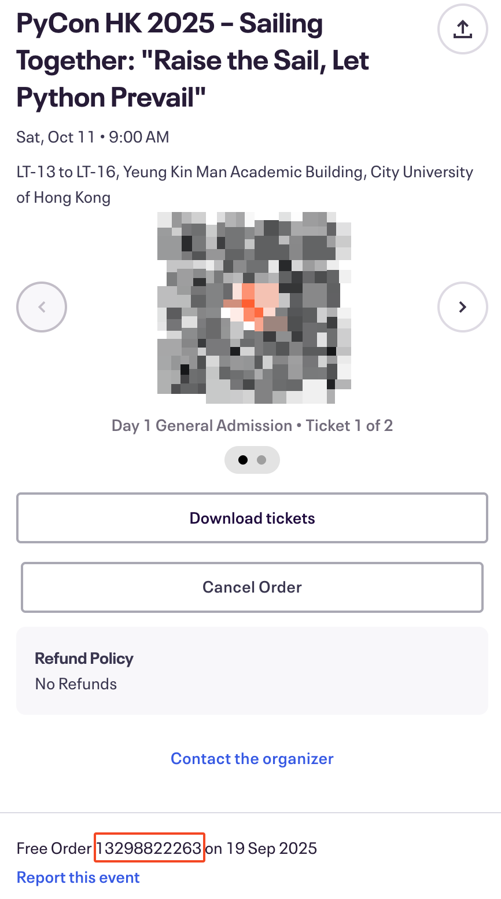

# PyCon HK 2025 Sprint Day - The Ticket Challenge 🎟️

Welcome, developer! We're excited you're interested in joining our **Sprint Day at PyCon HK 2025**. Due to overwhelming demand, our initial tickets are gone. However, we've reserved a special batch for those who can demonstrate their Python prowess by solving this challenge.

This isn't just a CTF (Captur The Flag)—it's **your ticket** to the event. By solving the puzzle and submitting a valid "ticket signature," you'll prove your skills and secure your place in line for a spot at the Sprints.

The tickets will be distributed to those **who successfully get their solutions merged into the repository**. The earlier you submit, the better your chances of getting a ticket!

---

## 🚀 The Mission: Forge Your Ticket

Your mission is to fix a "broken" Python script, `solver.py`. This script contains several small puzzles that test your understanding of Python. Once solved, the script will interact with a pre-compiled `encryptor` binary to generate a unique digital signature for your personal Ticket ID.

This signature is your "proof-of-work," and submitting it correctly is how you claim your spot.

## 🏁 How to Play: A Step-by-Step Guide

### Step 1: Fork the Repository

At the top-right of this page on GitHub, click the **"Fork"** button. This will create a personal copy of this repository under your own GitHub account.


### Step 2: Clone Your Fork

Now, clone **your forked repository** (not the original one) to your local machine.

```bash
# Replace <YOUR_GITHUB_USERNAME> with your actual username
git clone https://github.com/<YOUR_GITHUB_USERNAME>/pyconhk-2025-sprint-extra-tickets.git
cd pyconhk-2025-sprint-extra-tickets
```

### Step 3: Download and Verify the Challenge Binary

The `encryptor` binary is a critical part of this challenge. It is a pre-compiled, statically-linked Linux executable.

1.  **Download the Binary:**
    Go to the official release page and download the `encryptor` file.
    *   **Release Link:** [**v1.0.0 Release Page**](https://github.com/pyconhk/pyconhk-2025-sprint-extra-tickets/releases/tag/v1.0.0)

2.  **Verify the Integrity (Important!):**
    To ensure your downloaded file is not corrupt, check its SHA256 hash. Open a terminal and run:
    ```bash
    sha256sum encryptor
    ```
    The output hash **must** match the following value exactly:
    `96e2b028f0952de96cd0a71e575c4fe392f5f95b885c6dcc23c542a860a7d1d5`

3.  **Place the Binary:**
    After verifying the hash, move the `encryptor` file into the root directory (`pyconhk-2025-sprint-extra-tickets`) of this project repository, alongside `solver.py`.

### Step 4: Solve the Puzzle

1.  **Choose Your Ticket ID:**
    Open `ticket.txt` and change the content to your ticket ID. This can be found in your Eventbrite confirmation email or on your Eventbrite account under "My Tickets".

    

    The Ticket ID is **a string of numbers** only. Make sure to replace the `<YOUR TICKET ID HERE>` placeholder with your actual Ticket ID.

2.  **Solve the Puzzle:**
    *   Read the puzzle instructions inside `solver.py`.
    *   **Edit `solver.py`** on your local machine to fix all the `<ans>` placeholders.
    *   Do **not add or remove any lines**—only replace the `<ans>` placeholders with your answers.

    > **Tips:** The first question doesn't contain the `<ans>` placeholder.

### Step 5: Set Up Your Execution Environment

You have two options for running this challenge. We **strongly recommend Docker** for a guaranteed-to-work experience.

#### Option A: Run with Docker (Recommended for All Users)

This is the easiest and most reliable method, regardless of your operating system (Windows, macOS, or Linux). All you need is [Docker](https://www.docker.com/get-started/) installed.

1.  **Build the Challenge Container:**
    This command builds a lightweight Linux environment with all tools included.
    ```bash
    docker buildx build --platform linux/amd64 -t pyconhk-sprint-challenge .
    ```

2.  **Enter the Container:**
    Start an interactive shell inside the container.
    ```bash
    docker run --rm pyconhk-sprint-challenge
    ```
    The container will run the `python solver.py` command automatically and output your ticket signature if everything is correct.

Whenever you have made any changes to `solver.py`, **you must rerun all the substeps above in step 5A** to see the updated output.

#### Option B: Run on a Native Linux (amd64) System

If you are running a standard Linux distribution (like Ubuntu, Debian, Fedora) on an `amd64` (x86-64) machine, you can run the challenge directly.

> **Note on `glibc` vs. `musl`:** The provided `encryptor` binary is **statically linked**. This means it has no external dependencies on C libraries like `glibc` or `musl`. It will run correctly on **any** Linux distribution with a compatible kernel, including Alpine Linux.

1.  **Install Python Dependencies:**
    ```bash
    pip install -r requirements.txt
    ```
2.  **Make the Binary Executable:**
    ```bash
    chmod +x encryptor
    ```
3.  **Run the Solver:**
    ```bash
    python solver.py
    ```

The static binary will check for the parent caller process where you **must invoke the file as `python solver.py`**. Running `./solver.py` directly or `python3 solver.py` will not work.

---

## 🚩 How to Claim Your Sprint Day Ticket

Submission is done by opening a Pull Request (PR).

1.  **Create a New Branch:**
    ```bash
    git checkout -b submission/<your-ticket-id>
    ```

2.  **Create Your Ticket File:**
    Create a new file in the `tickets/` directory, named after your Ticket ID. The content of this file should be **only** the Base64 signature you generated.
    ```bash
    # Example:
    echo "PASTE_YOUR_BASE64_SIGNATURE_HERE" > tickets/<your-ticket-id>.txt
    ```

    > **Important:** Modifying `tickets/<YOUR TICKET ID HERE>.txt` will result in an automatic rejection of your submission as we only accept a single file creation per PR. No other files should be changed.

3.  **Commit and Push:**
    ```bash
    git add tickets/
    git commit -m "Claim sprint ticket: <your-ticket-id>"
    git push -u origin submission/<your-ticket-id>
    ```

4.  **Open a Pull Request** on GitHub to the `main` branch. An automated system will immediately check your signature.

*   A **green checkmark ✅** means your submission is valid and you've reserved your spot **in the queue**! Please note that you are **guaranteed a ticket only if your PR is merged**.

*   A **red cross ❌** means the verification failed. Close the PR, debug your solution, and try again.

**Tickets are allocated on a first-come, first-served basis for valid PRs. Good luck, and we can't wait to see you at the Sprints!**
